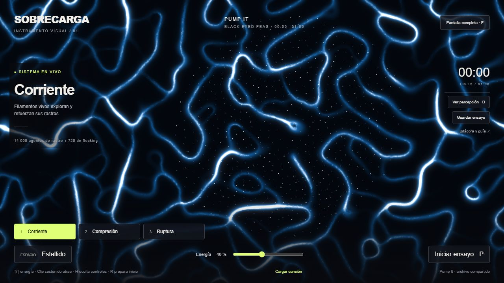
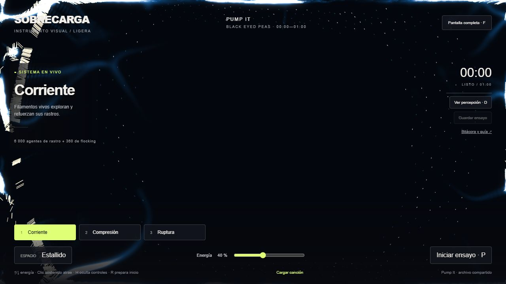
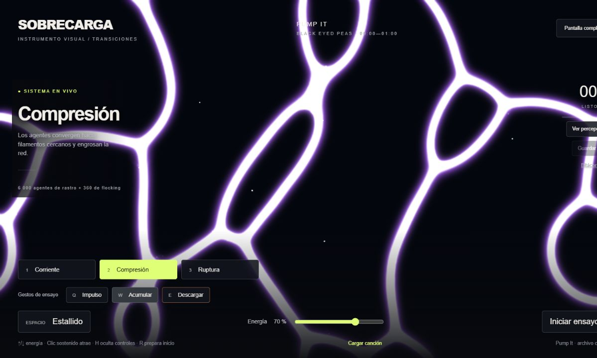
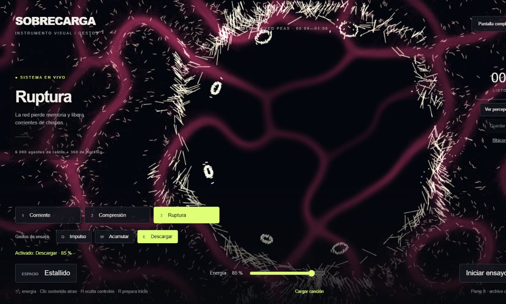

# Unidad 6 · Sobrecarga

Autor: Juan Esteban Araujo. Trabajo individual. Entrega: viernes 2 de octubre de 2026.

**Estado:** prototipo local en revisión. Música: primer minuto de Pump It, Black Eyed Peas, desde `videoplayback.m4a` compartido por el usuario e incorporado como `assets/pump-it.m4a`. Reproducción y corte al minuto comprobados; falta ensayo musical del estudiante. Este documento registra trabajo y pruebas del asistente; no atribuye al estudiante reflexiones o experiencias que todavía no ha expresado.

## 1. Intención y concepto

La intención indicada por el estudiante es una experiencia explosiva acorde con la canción. La propuesta del asistente, Sobrecarga, desarrolla esa intención como acumulación, liberación y reorganización de energía. Su aprobación estética está pendiente.

Se implementaron flocking, seguimiento de un campo de flujo y steering de atracción/repulsión. Tres combinaciones de reglas permiten pasar entre corriente, compresión y ruptura conservando los mismos agentes. La persona decide cuándo intervenir al escuchar; el sistema no analiza frecuencias ni dispara cambios visuales por el cronómetro.

## 2. Qué se aprendió de los referentes

- The Nature of Code permite distinguir posición y velocidad del agente, velocidad deseada y corrección de steering. En flocking, las reglas de separación, alineación y cohesión dependen de vecinos cercanos.
- En la explicación de Physarum de Bleuje, cada agente consulta rastros con sensores orientados, gira, avanza y deposita nuevas señales; el rastro se difunde y decae. Su estructura de red emerge de esa realimentación. Una apariencia de red no demuestra que exista una red neuronal artificial.
- La versión 3 de Sobrecarga incorpora Physarum real: 14 000 agentes leen tres muestras locales del rastro, cambian su orientación y depositan señal. La difusión y evaporación modifican el entorno. Se conservan 720 agentes de flocking como chispas; D inspecciona esta población. No se implementa aprendizaje neuronal.

## 3. Percepción, estado y acción

Cada agente de flocking guarda posición y velocidad. Consulta vecinos dentro de un radio de 48 px, ampliado a 62 px en Compresión. Los vecinos a menos de 24 px provocan separación. El campo de flujo se consulta en la posición actual; el mouse solo atrae dentro de 240 px. Los bordes se perciben en una franja de 65 px.

Se combinan las correcciones hacia velocidades deseadas. Antes de avanzar se limita la fuerza y luego la velocidad. El estallido cambia el entorno: una onda temporal de repulsión atraviesa el espacio. Solo los agentes alcanzados pueden girar y acelerar más; su trazo se ilumina para mostrar esa reacción local. Después recuperan los límites ordinarios.

No existe líder. La grilla usada para buscar vecinos reduce cálculos sin ampliar la percepción. Todos calculan con el estado previo del conjunto; después se aplican los cambios.

## 4. Decisiones visuales y controles

| Decisión | Función |
| --- | --- |
| Fondo oscuro y trazos luminosos | Leer dirección, densidad y dispersión |
| Azul/cian en la red y naranja/blanco en Ruptura | Contrastar continuidad y liberación; color elegido por el modo manual |
| 1: Corriente | Dar predominio al campo de flujo y mantener continuidad |
| 2: Compresión | Aumentar cohesión local y radio de percepción para construir tensión |
| 3: Ruptura | Aumentar separación y reducir alineación para fragmentar el conjunto |
| Espacio | Intervenir un acento con una onda de repulsión |
| Clic sostenido | Reunir o desviar agentes cercanos |
| Energía | Cambiar velocidad máxima y capacidad de giro |
| D: percepción | Explicar qué vecinos puede usar un agente; ocultar durante el performance |

## 5. Predicciones para verificar con el estudiante

Estas son hipótesis de ensayo, no resultados personales ya realizados:

1. Al pasar de Corriente a Compresión deben aparecer agrupaciones locales más persistentes. Comparar varias ejecuciones; no esperar una única figura exacta.
2. Ruptura debe reducir la compactación de agrupaciones próximas, sin garantizar que todo el conjunto se disperse por igual.
3. Un estallido debe alterar primero los agentes próximos a la onda. Un agente lejano no debería reaccionar simultáneamente.
4. Subir energía debe aumentar la rapidez y la capacidad de cambio de dirección, manteniendo posiciones y velocidades finitas.
5. La misma regla puede producir recorridos distintos por las condiciones iniciales. Explicar lo que se repite y lo que cambia.

## 6. Evidencias técnicas realizadas por el asistente

- Comprobación de sintaxis de JavaScript.
- Prueba numérica en 12 escenarios: tres modos, energía mínima y máxima, y tamaños 1280×720 y 390×844. Se verificaron 1 555 200 actualizaciones, posiciones finitas, límites del escenario y velocidad ordinaria tras terminar el impulso.
- Comparación de trayectorias desde un mismo estado, con y sin intervención de estallido: existe una diferencia medible.
- Pruebas del reproductor mediante reloj simulado: detención al minuto, registro de intervenciones con tiempo del audio, bloqueo de audio sin cargar y cancelación de inicio pendiente.
- Prueba en navegador con un archivo sintético de silencio. La evidencia final y sus resultados se guardan en `pruebas/RESULTADOS.md`.

Estas evidencias no demuestran todavía rendimiento en el proyector ni calidad de la interpretación musical.

## 7. Score visual pendiente de ajuste musical

Esta secuencia es una propuesta expresiva para ensayar; no describe pasajes confirmados de la grabación:

| Pasaje que se identificará al escuchar | Intención | Intervención posible |
| --- | --- | --- |
| Inicio del fragmento | Presentar movimiento e impulso | Corriente, energía media |
| Pasaje de acumulación elegido | Concentrar tensión | Compresión y, si hace falta, atracción local |
| Acento destacado elegido | Liberar energía | Espacio; observar la propagación |
| Contraste siguiente | Fragmentar y volver a reunir | Ruptura y regreso a Corriente |
| Cierre del minuto | Resolver la interpretación | Decidir un último gesto y sostener su consecuencia |

El audio ya está confirmado. El 28 de septiembre se midió localmente el nivel RMS, sin conectarlo al control de la simulación. El inicio 0–5 s tiene menor nivel medio que 5–10 s. `SCORE.md` propone una preparación moderada y tres estallidos candidatos cerca de aumentos de envolvente en 17.70, 45.24 y 58.30 s. No se identifican versos, estribillos ni compases mediante esta medición: ajustar los gestos por escucha con el estudiante. El score orienta decisiones; no se programó como secuencia automática.

## 8. Ensayo y registro

1. La canción elegida se carga por defecto. Puede reemplazarse con Cargar canción. Se reproduce únicamente en el navegador.
2. Elegir estado inicial y energía. Pulsar P para comenzar desde 0:00.
3. Interpretar con 1, 2, 3, Espacio y mouse; escuchar y observar antes de la siguiente decisión.
4. El reproductor se detiene al minuto. Guardar ensayo descarga un JSON de acciones y tiempos; no contiene el archivo de audio ni reproduce automáticamente la sesión.
5. Anotar aparte: qué se quiso expresar, qué ocurrió, qué se cambiará y por qué. Los registros técnicos no sustituyen esta reflexión.

## 9. Autoevaluación del estudiante

El estudiante asignó **25/25 a cada criterio, total 100/100**, el 2 de octubre de 2026. Las evidencias siguientes apoyan su valoración; no constituyen una calificación del docente.

| Criterio | Nota personal | Evidencia |
| --- | --- | --- |
| Cumplimiento del encargo | 25/25 | Instrumento web individual, agentes locales, controles humanos y primer minuto |
| Comprensión y verificación | 25/25 | Descripción del modelo, visor de percepción y pruebas documentadas |
| Diseño e intención | 25/25 | Referentes Physarum, tres modos, ajustes de fluidez, transición y descarga |
| Interpretación humana | 25/25 | Gestos manuales, carga de Espacio, score orientativo y registro de acciones |

El estudiante confirmó que todos los controles funcionan. Las capturas son ejecuciones de desarrollo; no se afirma disponer de una grabación musical continua del estudiante. No se recibieron observaciones específicas sobre pasajes musicales.
## Referencias

- [Unidad 6 — Simulación](https://juanferfranco.github.io/simulacion-2026-20/units/unit6/).
- [The Nature of Code — Autonomous Agents](https://natureofcode.com/autonomous-agents/).
- [Bleuje — Algorithms for making interesting organic simulations](https://bleuje.com/physarum-explanation/).

## Revisión visual del 29 de septiembre · versión 3

El estudiante aportó tres referentes y pidió mayor explosividad. Se inspeccionaron imágenes de [Physarum no.5](https://www.youtube.com/watch?v=OVdqxvHCnPI), [Physarum no.3](https://www.youtube.com/watch?v=0SYk6pb3g2g), ambos de Etienne Jacob, y un fragmento en 2:00 de [The Physarum Game](https://www.youtube.com/watch?v=iJn0vFColAo). Se tomó como dirección la red orgánica luminosa; no se copiaron sus vídeos ni se afirma revisión completa del tercero.

Se añadió una población de 14 000 agentes con posición y orientación. Tres sensores muestrean el rastro a 6 celdas (11 en Compresión), dentro de una grilla de 640 columnas y altura adaptada al reinicio. Los depósitos se calculan aparte del campo previo, que se difunde hacia las cuatro celdas adyacentes y decae. Compresión aumenta alcance y depósito; Ruptura acelera movimiento y evaporación. Espacio modifica localmente dirección y velocidad al pasar una onda, visible como chispas blancas. El mouse solo afecta a agentes a menos de 240 px.

La versión anterior se conserva en `version-anterior/`. La nueva versión sigue controlada por decisiones humanas. Las pruebas del asistente no sustituyen un ensayo musical del estudiante. Pendientes: valoración estética del usuario, ensayo del minuto y autoevaluación personal antes de publicar.

## Optimización de fluidez · 30 de septiembre

El usuario reportó tirones, especialmente en navegador grande. Se conservan 14 000 agentes Physarum y 720 de flocking. Se eliminó la recuperación de hasta cinco pasos/dibujos por cuadro: ahora como máximo se ejecuta uno, conservando la fracción de tiempo residual. En equipos lentos la simulación puede avanzar más despacio, pero el audio y su corte siguen su propio reloj. Las pestañas ocultas no calculan la simulación.

El brillo se desenfoca en una superficie de 320 columnas, se limita el lienzo de salida a 1600 píxeles en su lado mayor y se simplifica la difusión. El arranque precalcula 12 pasos en lugar de 85, por lo que la red se desarrolla a la vista. La etiqueta FLUIDA identifica esta revisión. Prueba local orientativa: 6.63 ms por actualización en una muestra de 30, viewport 1062×1244. No es una garantía de FPS en otros navegadores ni una comparación controlada con idéntica red. Respaldo en respaldo-rendimiento/.

## Revisión LIGERA · 30 de septiembre

Por persistencia de tirones se redujo Physarum de 14 000 a 6000 agentes y flocking de 720 a 360. La señal depositada por cada agente Physarum se multiplica por 14000/6000 para mantener la cantidad total esperada de rastro. Se conserva grilla, sensores, difusión, evaporación y colores. Esto conserva el mecanismo y la estética general; no garantiza idénticas formas emergentes ni densidad local exacta.

Pruebas superadas: 12 escenarios de flocking (777 600 actualizaciones), estabilidad y localidad de Physarum, ciclo de audio y suspensión en pestaña oculta. Prueba orientativa en navegador a 1280×720: 4.44 ms por actualización ordinaria y 5.87 ms en muestra con estallido; no son FPS garantizados en otro navegador. Vista comprobada y guardada en vista-ligera.png. Pendiente confirmación del usuario en pantalla completa. Recargar hasta ver LIGERA.

## Revisión IMPACTO · 30 de septiembre

Aprobada por el usuario tras mejorar la fluidez. Conserva 6000 agentes de rastro y 360 auxiliares. Corriente aumenta la velocidad base; Compresión reduce velocidad al 55 %, amplía la apertura sensorial y aumenta depósito para acumular señal. Ruptura invierte la preferencia de sensores hacia zonas de menor rastro, acelera movimiento y evaporación. No agrega trayectorias globales ni conducción automática por música.

La onda manual activa un impulso local que conserva el 90 % por paso después de abandonar la onda; ese estado aumenta el desplazamiento y la longitud de estela, y decae sin afectar a agentes no alcanzados. Durante el impulso se reduce la respuesta al rastro para evitar que frene inmediatamente la descarga. Ruptura dibuja además un tercio de agentes como trazos móviles, manteniendo legibilidad cuando el campo se dispersa.

Pruebas numéricas y audio superadas; localidad de onda comprobada (2483 afectados y 3517 exteriores con actualización idéntica al control en esa muestra). Revisión visual de controles realizada. La mayor fuerza expresiva requiere ensayo con la canción; no se presenta como interpretación musical ya validada.

## Revisión TRANSICIONES · 2 de octubre de 2026
Cambios a partir de la devolución del usuario: mezcla progresiva de reglas, velocidad y color para evitar la parada al entrar en Compresión. Esta amplía sensores, reduce el giro y aumenta difusión; conserva avance y filamentos más gruesos. La primera variante con gradiente colapsó en nodos en prueba prolongada y se retiró. Se conserva 6000 Physarum + 360 flocking.
Gestos manuales Q (Corriente, 60 %), W (Compresión, 70 %) y E (Ruptura, 85 %, un estallido). Cada estado persiste hasta la siguiente decisión. Se descartó automatizar tramos porque la consigna exige interpretación humana. SCORE.md y guia.html proponen un ensayo orientativo del minuto.
Pruebas del asistente superadas: estabilidad horizontal/vertical, localidad de la onda, transición sin parada, gestos persistentes, ciclo de audio y límite de un paso por cuadro. No sustituyen ensayo ni autoevaluación del estudiante. Pendientes: ensayo personal, reflexión, autoevaluación y publicación.

## Evidencia visual de ejecución
Capturas reales tomadas durante las iteraciones y pruebas de desarrollo, incorporadas por solicitud del estudiante. Representan versiones diferentes; no se presentan como un ensayo musical continuo.

## Corrección de controles · 2 de octubre
Q/W/E admiten letra y código físico; cada activación ilumina el botón e indica nombre y energía. Verificación mediante teclado en navegador: Q→Corriente 60 %, W→Compresión 70 %, E→Ruptura 85 % y estallido. Hace falta foco dentro de la página; identificador GESTOS permite reconocer el archivo nuevo. No se ha identificado con certeza la causa del fallo en el navegador del estudiante.
Autoevaluación y publicación se aplazan por decisión del estudiante hasta completar el instrumento.

